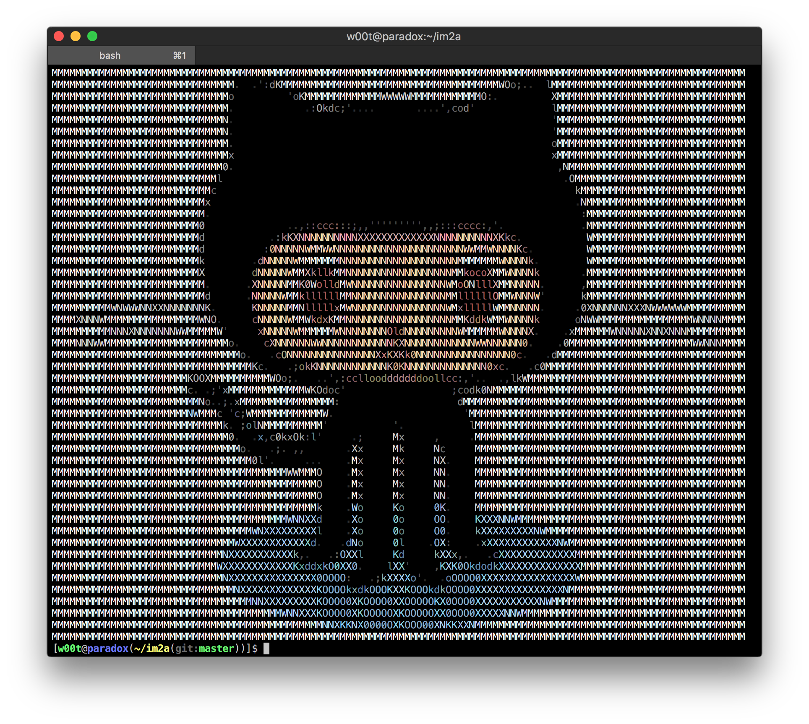
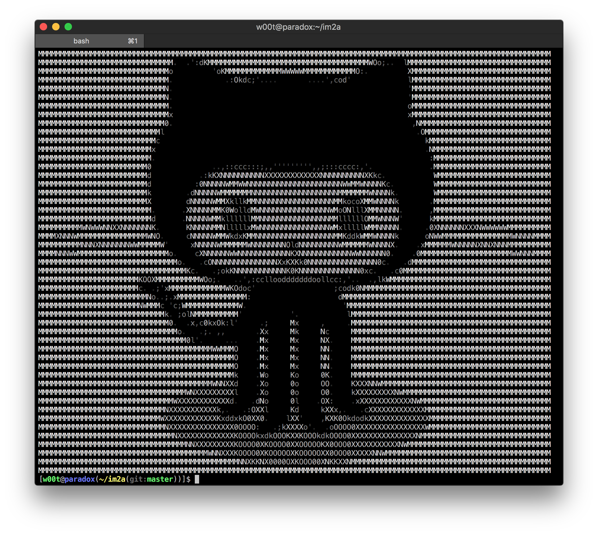
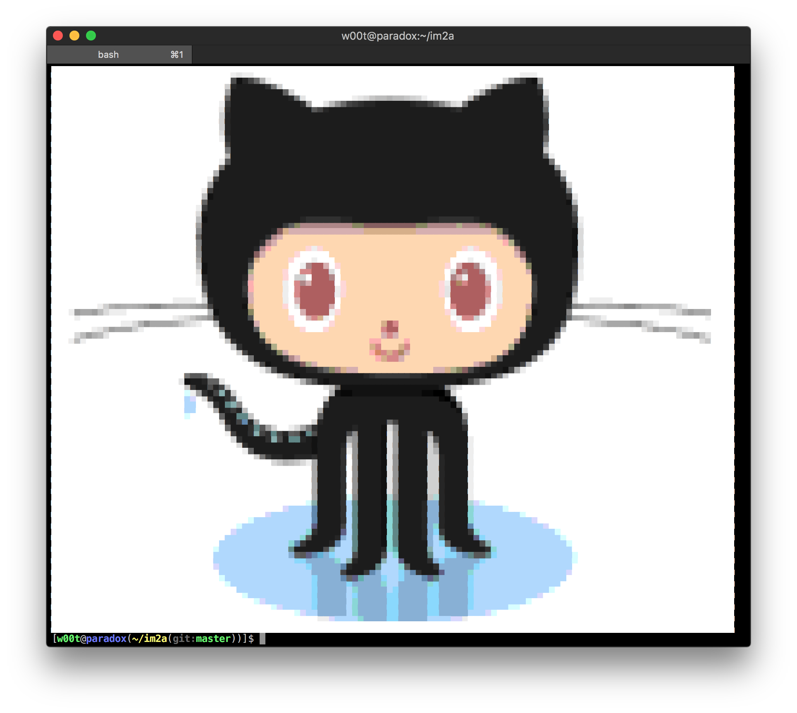

# im2a

An image to ASCII converter, made for 256-color terminals.

Here are some examples:

| Source                      | Default                      | Grayscale                    | Pixel                        | Grayscale + Pixel            |
| --------------------------- | ---------------------------- | ---------------------------- | ---------------------------- | ---------------------------- |
|  |  |  |  |  |

The idea came after [jp2a](http://csl.sublevel3.org/jp2a/) for its lack of 256-color terminal support and its JPEG format restriction.

## Dependencies

[ImageMagick](http://www.imagemagick.org/) - a great library for image manipulation. Chances are you already have it installed.

## Installation

Just like any other program that uses Autotools:

``` bash
./bootstrap
./configure
make install
```

### MacOS X

If you're using [Homebrew](http://brew.sh/) just type this in your terminal:

``` bash
brew install tzvetkoff/extras/im2a
```

## Usage

```
im2a 0.6.1

Convert image files to ASCII art
Copyright (C) 2013 Latchezar Tzvetkoff
Distributed under The Beerware License

Usage:
  ./build/bin/im2a [options] <file>

Common options:
  -h, --help                        Prints this message
  -v, --version                     Prints version string

Specific options:
  -m, --html                        Output HTML
  -i, --invert                      Invert the image
  -t, --center                      Center the image
  -p, --pixel                       Pixel mode
  -W, --width=N                     Set output width
  -H, --height=M                    Set output height
  -c, --charset=CHARSET             Set output charset
  -g, --grayscale                   Grayscale output instead of 256-color
  -T, --transparent                 Enable transparency
  -X, --transparency-threshold=X    Set transparency threshold (default: 1.0)
  -R, --red-weight=RW               Set red component weight (default: 0.2989)
  -G, --green-weight=GW             Set green component weight (default: 0.5866)
  -B, --blue-weight=BW              Set blue component weight (default: 0.1145)

Project homepage: https://github.com/tzvetkoff/im2a
Report bugs to: https://github.com/tzvetkoff/im2a/issues
```

## License

```
"THE BEER-WARE LICENSE" (Revision 42):
<Latchezar Tzvetkoff> wrote this file. As long as you retain this notice you
can do whatever you want with this stuff. If we meet some day, and you think
this stuff is worth it, you can buy me a beer in return. Latchezar Tzvetkoff
```
